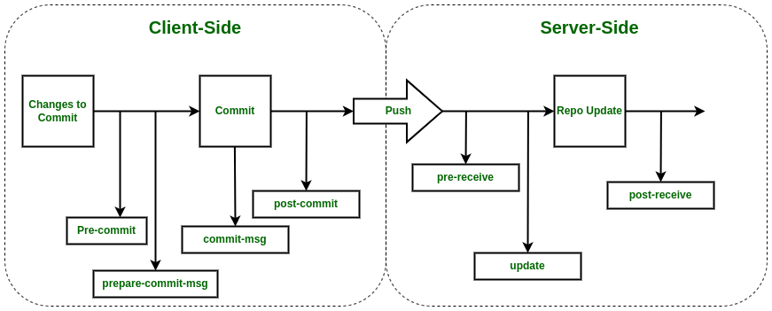

# Хуки

В процессе работы с git репозиторием, может возникнуть потребность автоматизации
некоторых действий. Для этой цели существуют git-hooks.

Лучше меня скажет официальная документация:

> Как и многие другие системы контроля версий, Git предоставляет возможность запуска
> пользовательских скриптов в случае возникновения определённых событий. Такие
> действия называются хуками и разделяются на две группы: серверные и клиентские. Если
> хуки на стороне клиента запускаются такими операциями как слияние или создание
> коммита, то на стороне сервера они инициируются сетевыми операциями, такими как
> получение отправленного коммита. Хуки часто используются для широкого круга задач.

Размещается эта замечательная вещь в репозитории: ".git/hooks", либо сразу в папке "hooks"
для bare репозитория. Активированный хук состоит только из своего имени.

Нет информации о получении клиентских хуков с удаленного репозитория, есть только
догадки об этом. Скорее всего, хуки для каждого репозитория нужно активировать вручную.

Успешность выполнения хука определяет возвращаемым значением. Как у всех нормальных
программистов - 0 означает хорошо, все остальное обрывает выполнение операции.

Наглядное выполнение хуков

# Client side hooks

Эта группировка хуков для размещения на клиенте.

## prepare-commit-msg

Хук, вызывающийся после команды git commit перед вводом сообщения коммита.
Позволяет собрать шаблон сообщения, который можно будет отредактировать при вводе
сообщения

## pre-commit

Хук, выполняемый перед созданием коммита. Полезен для проверки вводимого сообщения
или внесенных изменений.

Можно обмануть, выполнив команду --no-verify (но не рекомендую этим заниматься)

# Server side hooks

Эта группировка хуков размещается на стороне сервера и влияет на все дочерние
репозитории в части взаимодействия

## pre-recieve

Хук пред получения. Вызывается после получения команды на получение изменений из
рабочей копии. На стороне клиента - после команды push и перед слиянием изменений.
Особенность хука в том, что он не получает информации в качестве аргументов, а
использует стандартный поток ввода, откуда считывает хэши старой и новой версии, а также
название ссылки (ветки), в которую планируется внести изменения. Для случая со
множеством изменений, эта информация будет предоставлена в виде массива со всеми
изменяемыми ветками

Предлагаемый хук служит для контроля доступа к веткам и сообщения коммита. В
директории "security" хранится информация о стиле коммита, каким пользователям
разрешено делать пуш в какие ветки. Директория "scripts" хранит рабочий скрипт и
вспомогательные вещи для его работы на языке python.

# Предложения по улучшению скриптов

- [ ] pre-recieve: Проверка соответствия истории между последним коммитом ветки и
  последним коммитом push-а ссылки. Для того чтобы в историю не могли попасть
  "неправильные" коммиты
- [ ] pre-recieve: Перенести получение информации о получаемой ссылки в скрипт

# Соус

* https://xakep.ru/2016/02/11/git-hook-magic/#toc02.1
* https://habr.com/ru/companies/dins/articles/584562/
* https://www.atlassian.com/git/tutorials/git-hooks
* https://www.atlassian.com/ru/git/tutorials/git-hooks
* https://git-scm.com/book/ru/v2/%D0%9D%D0%B0%D1%81%D1%82%D1%80%D0%BE%D0%B9%D0%BA%D0%B0-Git-%D0%A5%D1%83%D0%BA%D0%B8-%D0%B2-Git

