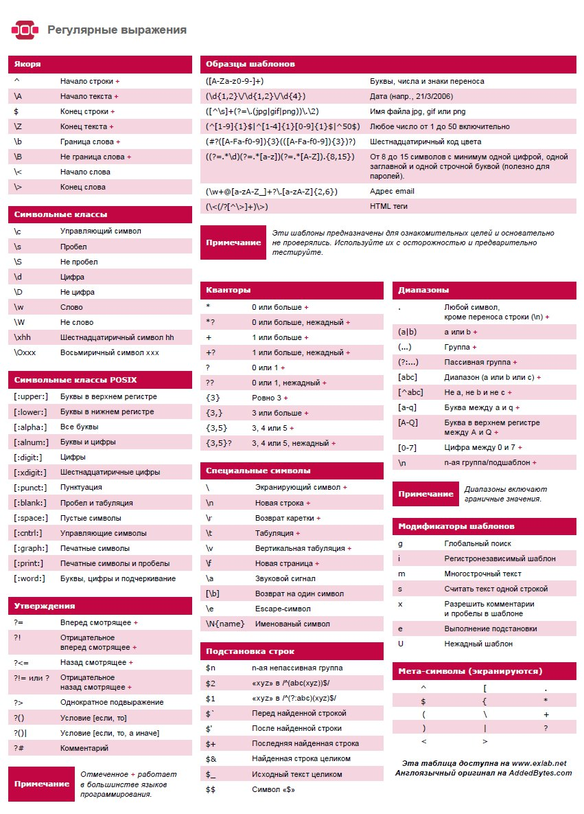

* [Назад](./Readme.md)

- [Регулярные выражения](#регулярные-выражения)
  - [Краткая шпаргалка](#краткая-шпаргалка)
- [В разных языках программирования](#в-разных-языках-программирования)
  - [Питон](#питон)
  - [С++](#с)

# Регулярные выражения

Формальный язык, используемый в работе с текстом, для поиска и осуществления манипуляций с подстроками в тексте

## Краткая шпаргалка



Сайт для проверки регулярных выражений:

* https://regex101.com

# В разных языках программирования

## Питон

```python
import re

matchs = re.search(regex, where)
matchGroup = matchs.group(numberGroup)
```

## С++

В С++ используется библиотека regex (C++11), но её использование сомнительно, т.к. для использование объектов библиотеки тянет за собой создание множества других объектов (???)

```cpp
#include <regex>
```

